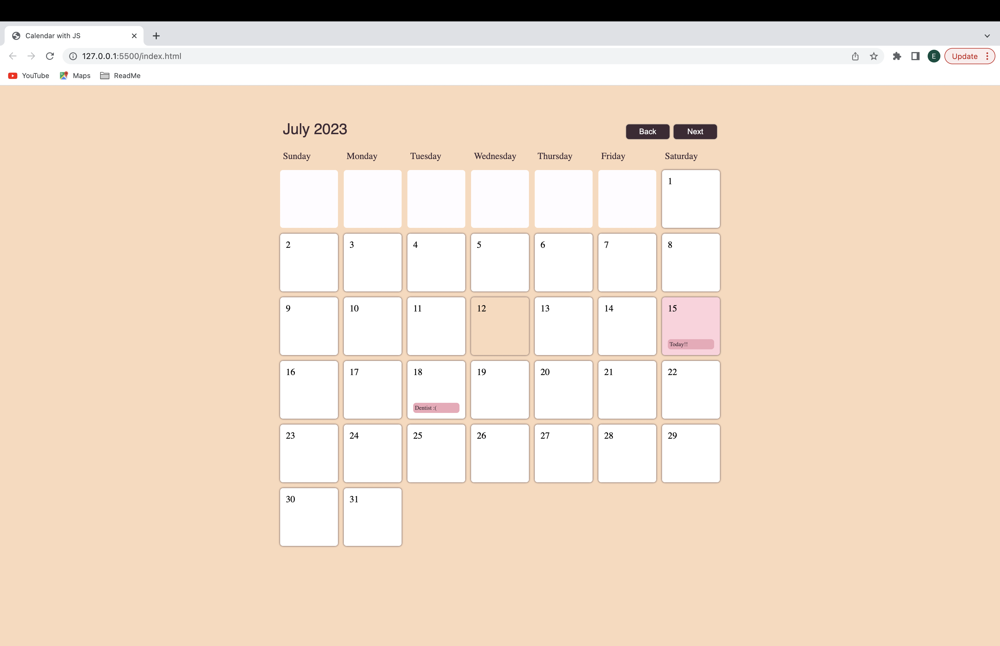

# My Calendar

My Calendar is an easy way to look at the current month, look at the months in the year, and plan events on given days.




## Usage

```
function deleteEvent() {
  events = events.filter(e => e.date !== clicked);
  localStorage.setItem('events', JSON.stringify(events));
  closeModal();
}
```
```
.event {
  font-size: 10px;
  padding: 3px;
  background-color: #EFA8B8;  /*cherry blossom pink  */ 
  color: #3E2A35;     /*   dark purple  */ 
  border-radius: 5px;
  max-height: 55px;
  overflow: hidden;
}
```
